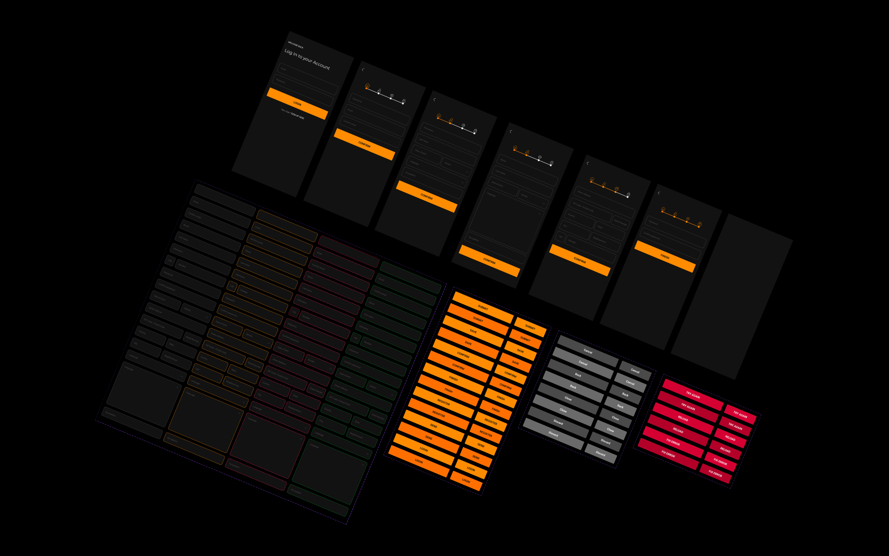

Este é um projeto de formulário multi-etapas desenvolvido em **React Native** utilizando o framework **Expo**. O objetivo é coletar informações do usuário em várias etapas e enviá-las para um backend integrado com **Node.js** e **MySQL**.

---

## 📋 **Funcionalidades**

- Formulário dividido em várias etapas:
  - **Etapa 1**: Username e Email.
  - **Etapa 2**: Informações pessoais (nome, sobrenome, data de nascimento, etc.).
  - **Etapa 3**: Endereço do usuário.
  - **Etapa 4**: Senha e confirmação.
- Validação de campos com **React Hook Form**.
- Navegação entre telas com **React Navigation**.
- Armazenamento de dados entre etapas utilizando **Context API**.
- Envio dos dados completos para o backend via requisição **POST**.
- Backend com **Express** e banco de dados **MySQL**.

---

## 🛠️ **Tecnologias Utilizadas**

### **Frontend**

- **React Native** com **Expo**.
- **React Hook Form** para validação de formulários.
- **React Navigation** para navegação entre telas.
- **Axios** para requisições HTTP.
- **Expo Font** para fontes customizadas.

### **Backend**

- **Node.js** com **Express**.
- **MySQL** para armazenamento de dados.
- **bcrypt** para criptografia de senhas.

---

## 🚀 **Como Executar o Projeto**

### **Pré-requisitos**

- Node.js instalado.
- Expo CLI instalado globalmente:
  ```bash
  npm install -g expo-cli
  ```

## 📂 **Estrutura do Projeto**

```plaintext
React-form/
├── android/                # Configurações do Android
├── assets/                 # Imagens e fontes
├── src/
│   ├── app/                # Telas do aplicativo
│   ├── components/         # Componentes reutilizáveis
│   ├── context/            # Context API para gerenciamento de estado
│   ├── data/               # Configurações do backend e banco de dados
│   ├── hooks/              # Hooks customizados
│   ├── routes/             # Configuração de rotas
│   └── styles/             # Estilos globais
├── [App.tsx](http://_vscodecontentref_/0)                 # Arquivo principal do aplicativo
├── [package.json](http://_vscodecontentref_/1)            # Dependências do projeto
├── [tsconfig.json](http://_vscodecontentref_/2)           # Configurações do TypeScript
└── README.md               # Documentação do projeto
```

## 📝 **Licença**

Este projeto está sob a licença MIT. Consulte o arquivo LICENSE para mais informações.

## 💬 **Contato**

Autor: Victor Soares
GitHub: vitu6569
Email: victoralmeida6569@gmail.com
